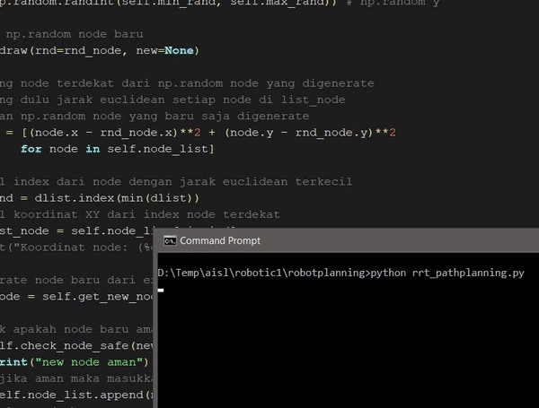

# Robotics path planning using RRT algorithm
Path planning in an indoor room with several obstacles for robotics using Rapidly-exploring Random Tree algorithm.

How to run.
1. Install python3
2. Install numpy and matplotlib packages
    - pip install numpy
    - pip install matplotlib
3. Git clone this repo or download
4. Go to repo's directory
5. Open terminal / cmd
    - python rrt_pathplanning.py
6. Enjoy!
